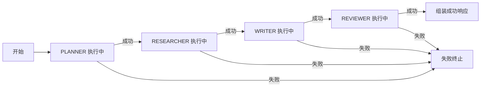

# 第六章 Coordinator 调度中心与 AgentManager 花名册

> 本章目标：剖析 `Coordinator`（调度大脑）与 `AgentManager`（Agent 花名册）如何用"状态机 + 自动装配"编排整条流水线，并展望与 Workflow / MCP 的整合方向。这是把一群独立 Agent"组织起来干活"的关键。

---

## 6.0 本章导读

前五章我们有了：接口骨架（3章）、四个能干活的 Agent（4章）、共享黑板（5章）。但还缺一个"总指挥"——谁来决定"先让谁干、再让谁干、出错了怎么办"？

这就是本章的两个主角：

- **AgentManager**：Agent 的"花名册"。负责收集所有 Agent，按角色建索引，供人查用。
- **Coordinator**：调度"大脑"。负责按既定顺序驱动 Agent、传递上下文、处理失败、组装最终结果。

它们的关系是：**Coordinator 通过 AgentManager 找到该用的 Agent，然后驱动它们干活**。就像项目经理（Coordinator）拿着员工花名册（AgentManager），按项目计划（PIPELINE）依次派活。

---

## 6.1 AgentManager：Spring 自动装配的魔法

### 6.1.1 完整源码

```java
@Slf4j
@Component
public class AgentManager {

    /** 角色 -> Agent 的花名册 */
    private final Map<AgentRole, Agent> registry = new EnumMap<>(AgentRole.class);

    /**
     * 构造时由 Spring 注入容器内所有 Agent 实现，自动建立花名册。
     */
    public AgentManager(List<Agent> agents) {
        for (Agent agent : agents) {
            AgentRole role = agent.role();
            Agent old = registry.put(role, agent);
            if (old != null) {
                log.warn("[AgentManager] 角色 {} 存在多个实现，后者覆盖前者：{}",
                        role, agent.getClass().getSimpleName());
            }
        }
        log.info("[AgentManager] 已注册 {} 个 Agent：{}", registry.size(), registry.keySet());
    }

    public Agent get(AgentRole role) {
        Agent agent = registry.get(role);
        if (agent == null) {
            throw new IllegalStateException("未找到角色对应的 Agent：" + role);
    }
        return agent;
    }

    public boolean has(AgentRole role) {
        return registry.containsKey(role);
    }
}
```

### 6.1.2 核心魔法：`List<Agent>` 自动装配

**最关键的一行是构造器参数 `List<Agent> agents`**。这是 Spring 的一个强大特性：

> 当你在构造器（或字段）声明 `List<某接口>` 时，Spring 会**自动把容器里所有实现了该接口的 Bean** 收集成一个 List 注入进来。

所以当 Spring 启动时：

1. 扫描到 `@Component` 的 PlannerAgent、ResearchAgent、WriterAgent、ReviewerAgent；
2. 发现它们都实现了 `Agent` 接口；
3. 自动把这 4 个实例打包成 `List<Agent>` 注入 AgentManager 构造器。

**AgentManager 完全不需要知道有哪几个 Agent、叫什么名字**——它只管遍历这个 List，按每个 Agent 的 `role()` 建花名册。

### 6.1.3 EnumMap：为枚举键定制的高效 Map

```java
private final Map<AgentRole, Agent> registry = new EnumMap<>(AgentRole.class);
```

为什么用 `EnumMap` 而不是 `HashMap`？因为键是枚举 `AgentRole`。`EnumMap` 是**专为枚举键优化的 Map**：

- 底层用**数组**实现（枚举的 ordinal 作下标），存取是 O(1) 且无哈希冲突；
- 内存紧凑、遍历有序（按枚举定义顺序）；
- 性能优于 HashMap。

**这是一个"用对数据结构"的细节**。当 Map 的键确定是枚举时，EnumMap 是最佳选择。

### 6.1.4 重复角色告警：防御式设计

```java
Agent old = registry.put(role, agent);
if (old != null) {
    log.warn("[AgentManager] 角色 {} 存在多个实现，后者覆盖前者：{}", ...);
}
```

`Map.put` 会返回旧值。如果 `old != null`，说明**同一个角色注册了两次**（比如手滑写了两个 `role()` 都返回 PLANNER 的 Agent）。这时打 warn 日志提醒开发者。**它不阻止运行（后者覆盖前者），但留下明确痕迹**，方便排查"为什么我的 Agent 没生效"。

### 6.1.5 OCP 的完美落地

现在回答第三章的伏笔——**为什么 AgentManager 能实现"新增 Agent 零改动"？**

假设你要加一个 `TranslatorAgent`：

```java
@Component
public class TranslatorAgent extends AbstractAgent {
    @Override public AgentRole role() { return AgentRole.TRANSLATOR; }
    @Override protected AgentResult doExecute(AgentContext ctx) { /* 翻译逻辑 */ }
}
```

**只需新建这一个类**。Spring 启动时会自动把它加进 `List<Agent>`，AgentManager 自动收录，`get(TRANSLATOR)` 立刻可用。**AgentManager、Coordinator 一行都不用改**。

这就是**开闭原则（对扩展开放，对修改关闭）**的教科书级落地——扩展系统能力靠"加新类"，而非"改老类"。

---

## 6.2 Coordinator：流水线的调度大脑

### 6.2.1 职责边界

Coordinator 的注释说得很清楚：

```java
/**
 * Coordinator 不干具体活儿（不写大纲、不查素材），它只负责一件事——
 * 按既定流程编排 Agent、驱动流水线前进。
 */
```

这是 SRP 的严格贯彻——**Coordinator 只管"调度"，不管"业务"**。业务在四个 Agent 里，调度在 Coordinator 里，两者泾渭分明。

### 6.2.2 PIPELINE：固化的流水线顺序

```java
private static final List<AgentRole> PIPELINE = List.of(
        AgentRole.PLANNER,
        AgentRole.RESEARCHER,
        AgentRole.WRITER,
        AgentRole.REVIEWER
);
```

**用一个静态常量 List 定义流水线顺序**。这是"把协同策略数据化"的思想——流程不写死在一堆 if-else 里，而是声明成一份"清单"。想调整流程？改这个 List 即可（如插入 TRANSLATOR、或调换顺序）。**流程即数据，数据易维护**。

### 6.2.3 coordinate 方法：四步调度

```java
public ContentResponse coordinate(Task task) {
    // 1) 初始化协作现场：黑板 + 上下文
    SharedMemory memory = new SharedMemory();
    AgentContext context = new AgentContext(task, memory);
    log.info("[Coordinator] 开始协作，taskId={}，主题={}", task.getTaskId(), task.getTopic());

    // 2) 调度循环：按流水线顺序逐个驱动 Agent
    for (AgentRole role : PIPELINE) {
        if (!agentManager.has(role)) {
            String msg = "流水线缺少角色实现：" + role;
            log.error("[Coordinator] {}", msg);
            return ContentResponse.fail(msg, context.getLogs());
        }

        Agent agent = agentManager.get(role);
        AgentResult result = agent.execute(context);

        // 3) 快速失败：任一环节失败即终止，带上已产生的日志便于排查
        if (!result.isSuccess()) {
            String msg = role.getDisplayName() + " 环节失败：" + result.getMessage();
            log.error("[Coordinator] {}", msg);
            return ContentResponse.fail(msg, context.getLogs());
        }
    }

    // 4) 全部成功：从黑板取出成品组装响应
    String article = memory.getString(SharedMemory.Keys.DRAFT);
    String review = memory.getString(SharedMemory.Keys.REVIEW);
    Double score = memory.get(SharedMemory.Keys.SCORE, Double.class);

    if (article == null || article.isBlank()) {
        return ContentResponse.fail("流程结束但未产出文章草稿", context.getLogs());
    }

    log.info("[Coordinator] 协作完成，taskId={}，评分={}", task.getTaskId(), score);
    return ContentResponse.ok(article, score, review, context.getLogs());
}
```

**四步逐点解读**：

1. **初始化协作现场（第 1 步）**：`new SharedMemory()` + `new AgentContext(task, memory)`。**每个任务一块独立黑板、独立上下文**（第五章 FAQ 讲过的隔离设计）。这保证并发多任务互不干扰。

2. **调度循环（第 2 步）**：遍历 PIPELINE，逐个角色执行。执行前先 `agentManager.has(role)` 检查——如果某角色没实现（比如漏了注册），提前失败并给出清晰原因 `"流水线缺少角色实现：XXX"`，而不是到 `get` 时抛异常。**防御式检查前置**。

3. **快速失败（第 3 步）**：`if (!result.isSuccess())`——任一 Agent 失败，立即终止整条流水线，返回 `ContentResponse.fail(msg, context.getLogs())`。**注意关键点：返回时带上 `context.getLogs()`**——已经执行过的环节日志全都带回去。这样调用方能看到"失败前走到了哪一步、每步产出了什么"，排查极其方便。这是第二章"快速失败 + 全链路可观测"的落地。

4. **组装结果（第 4 步）**：全部成功后，从黑板取 DRAFT/REVIEW/SCORE 组装 `ContentResponse`。这里还有一道**最终防线**——`if (article == null || article.isBlank())`：即使四步都"成功"了，但草稿莫名其妙没产出，也要兜底返回失败，绝不返回一个"成功但没内容"的响应。

---

## 6.3 状态机视角：调度循环的本质

Coordinator 的注释里提到"状态机雏形"。我们展开理解——把流水线看作一个状态机：



**每个 Agent 是一个"状态"，执行结果驱动状态转移**：

- 成功 → 前进到下一个状态（下一个 Agent）；
- 失败 → 转移到终止状态（快速失败）。

当前 V1 是最简单的"线性状态机"（顺序流水线）。但这个模型很容易扩展成复杂状态机——比如"评审不通过就退回写作"就是一条"回边"，构成循环状态机。理解了这个视角，你就明白为什么说 Coordinator 是"调度大脑"而非"简单的顺序调用"。

---

## 6.4 进阶调度策略：从顺序到智能

V1 的顺序流水线是最基础的协同策略。真实的企业系统会演进出更复杂的策略，全部可以在 Coordinator 里扩展：

| 策略 | 说明 | 如何在 Coordinator 落地 |
| --- | --- | --- |
| **顺序流水线**（V1） | A→B→C→D 一条龙 | 遍历 PIPELINE（当前实现） |
| **条件分支** | 根据评分决定是否发布 | 循环后加 `if (score < 阈值)` 判断 |
| **返工循环** | 评审不通过退回重写 | while 循环，评分不达标就重跑 WRITER |
| **并行聚合** | 多个 Research 并发跑 | 用线程池并发 execute，等待汇总 |
| **动态编排** | LLM 自己决定下一步用谁 | Coordinator 调 LLM 做"路由决策" |

**关键点**：无论策略多复杂，**变化都收敛在 Coordinator 一个类里**。四个 Agent、AgentManager、黑板都不用动。这就是"把易变的调度逻辑集中到一处"的架构价值——变化是隔离的、可控的。

### 6.4.1 返工循环示例（进阶思路）

```java
// 伪代码：评审不通过就退回重写，最多 3 次
int retry = 0;
double score = 0;
do {
    agentManager.get(AgentRole.WRITER).execute(context);
    agentManager.get(AgentRole.REVIEWER).execute(context);
    score = context.getMemory().get(Keys.SCORE, Double.class);
    retry++;
} while (score < 0.7 && retry < 3);
```

这就把"线性流水线"升级成了"带反馈的闭环"。**注意：这个判断逻辑属于 Coordinator，绝不该放进 ReviewerAgent**——这是第四章练习 3 的答案，调度决策是 Coordinator 的职责。

---

## 6.5 展望：与 Workflow / MCP 的整合方向

本项目 V1 是一个**自包含**的 Multi-Agent 框架。在真实企业平台中，它常常要和 Workflow 引擎、MCP 协议整合。这里做方向性展望（V1 未实现，作为进阶指引）：

### 6.5.1 与 Workflow 引擎整合

企业级流程往往需要**可视化编排、审批节点、定时触发、持久化状态**。这时可以：

- 把每个 Agent 封装成 Workflow 的一个"节点（Task Node）"；
- 用 Workflow 引擎（如 Flowable、Camunda、Temporal）替代 Coordinator 的调度循环；
- Coordinator 退化为"Agent 节点的适配器"。

**收益**：获得可视化流程图、断点续跑、人工审批介入等企业能力。**代价**：引入重量级依赖。V1 用轻量的 Coordinator，正是"先跑通、再按需升级"的务实选择。

### 6.5.2 与 MCP（Model Context Protocol）整合

MCP 是让 LLM 标准化地调用外部工具/数据源的协议。整合方向：

- 把 ResearchAgent 的"素材收集"接到 MCP Server，让它能真正联网检索、查数据库、调 API；
- LlmClient 的实现类可以是一个"MCP 客户端"，通过 MCP 调用带工具能力的模型。

**关键**：因为我们用了可插拔的 `LlmClient` 接口（第三章 DIP），接 MCP 只需**新增一个 `McpLlmClient implements LlmClient`**，四个 Agent 一行不改。**这再次印证了面向接口编程的威力**——预留的抽象让未来的整合成本极低。

> 💡 **架构启示**：好的架构不是"一次做全所有功能"，而是"预留好扩展点，让每次演进都是加法而非改造"。V1 的 LlmClient 接口、Coordinator 的集中调度、AgentManager 的自动装配，都是为未来整合埋下的"扩展点"。

---

## 6.6 企业案例：调度逻辑失控的"上帝 Service"

某团队最初没有独立的 Coordinator，而是把调度逻辑塞进了 `ContentService`——里面既 new Agent、又写 if-else 判断流程、还处理失败重试，一个方法 300 行。结果：

- 加一个 Agent 要改这个巨型方法，风险极高；
- 改流程顺序要在一堆 if-else 里找位置，容易改错；
- 无法单独测试"调度逻辑"，因为它和业务、Web 层全揉在一起。

重构引入独立 `Coordinator` + `AgentManager` 后：调度逻辑独立可测、流程数据化（PIPELINE 清单）、新增 Agent 零改动。**这就是"单一职责"和"关注点分离"带来的可维护性飞跃**。

---

## 6.7 常见问题 FAQ

**Q1：`List<Agent>` 自动装配的顺序能保证吗？**
A：默认按 Bean 定义顺序或 `@Order` 注解排序，**不可依赖它做流程顺序**。我们的流程顺序由 PIPELINE 常量显式定义，与注入顺序无关，这是正确做法。

**Q2：为什么 has 检查后还要 get？直接 get 抛异常不行吗？**
A：`has` 检查让 Coordinator 能返回"业务友好"的失败响应（带日志），而不是让 `get` 抛出的 `IllegalStateException` 冒泡成 500 错误。前置检查是为了更优雅的错误处理。

**Q3：Coordinator 是单例，多请求并发调 coordinate 会串数据吗？**
A：不会。coordinate 方法内所有状态（memory、context）都是**方法局部变量**，每次调用独立创建。Coordinator 本身无可变实例字段，天然线程安全。这是"无状态服务"的设计。

**Q4：如果我想中途插入一个"人工审核"节点怎么办？**
A：这正是 Workflow 引擎擅长的。V1 可以在 Coordinator 里加一个"暂停并等待外部信号"的机制，但更优雅的是整合 Workflow 引擎（见 6.5.1）。

---

## 6.8 面试高频题

1. **Spring 的 `List<某接口>` 自动装配是什么原理？你在哪里用了它？**
   （参考答案：Spring 自动收集容器内所有该接口的 Bean 成 List 注入。AgentManager 用它自动收集所有 Agent 建花名册，实现 OCP。）

2. **EnumMap 和 HashMap 有什么区别？何时用 EnumMap？**
   （参考答案：EnumMap 专为枚举键优化，底层数组实现、O(1)存取、遍历有序、内存紧凑。键确定是枚举时优先用它。）

3. **你的调度器如何保证"新增一个 Agent 不用改调度代码"？**
   （参考答案：AgentManager 自动装配收集 + Coordinator 依赖 Agent 抽象和 PIPELINE 声明，新增 Agent 只需加类。）

4. **什么是"快速失败"？你的系统怎么做的？失败时如何保证可排查？**
   （参考答案：任一环节失败立即终止不继续。Coordinator 检测 result 失败即 return，并携带 context.getLogs() 全链路日志，便于定位失败点和已产出。）

5. **如果评审不通过要退回重写，逻辑该放哪？为什么？**
   （参考答案：放 Coordinator，因为它是流程调度决策，属于 Coordinator 的 SRP 职责，不该污染 ReviewerAgent。）

---

## 6.9 本章练习（含参考答案）

**练习 1**：给 PIPELINE 在 WRITER 之后、REVIEWER 之前插入一个 `TRANSLATOR` 角色，需要改动几处？说明这体现了什么原则。

<details><summary>参考答案</summary>

改动两处：① 新建 `TranslatorAgent`（新类）；② 在 PIPELINE 列表里加一行 `AgentRole.TRANSLATOR`。AgentManager、其他 Agent、黑板都不用动。体现了 **OCP**（扩展靠加、流程数据化）和**关注点分离**。
</details>

**练习 2**：实现 6.4.1 的"返工循环"——评分低于 0.7 时退回重写，最多 3 次。说明为什么这个循环放在 Coordinator 而非 ReviewerAgent。

<details><summary>参考答案</summary>

```java
int retry = 0;
double score;
do {
    agentManager.get(AgentRole.WRITER).execute(context);
    agentManager.get(AgentRole.REVIEWER).execute(context);
    Double s = context.getMemory().get(SharedMemory.Keys.SCORE, Double.class);
    score = s == null ? 0 : s;
    retry++;
} while (score < 0.7 && retry < 3);
```
放 Coordinator 因为"是否返工"是**流程调度决策**，属于 Coordinator 的单一职责；ReviewerAgent 只负责打分，不该关心流程走向（SRP）。
</details>

**练习 3**：如果要接入真实联网检索的 MCP 能力，最小改动是什么？涉及哪个接口？

<details><summary>参考答案</summary>

最小改动：新增一个 `McpLlmClient implements LlmClient`（或让 ResearchAgent 依赖一个新的检索接口），用 `@Primary` 或配置开关替换 MockLlmClient。涉及第三章的 `LlmClient` 抽象接口。四个 Agent 业务代码一行不改——这是 DIP 预留扩展点的红利。
</details>

---

## 6.10 本章任务

> ✅ **动手清单**（对应代码：`agent/coordinator/AgentManager.java`、`agent/coordinator/Coordinator.java`）

1. 阅读 `AgentManager.java`，理解 `List<Agent>` 构造器注入如何自动建花名册。
2. 阅读 `Coordinator.java`，找出 PIPELINE 声明和 coordinate 的四步调度。
3. 找出"快速失败"的那行 `if (!result.isSuccess())`，理解为什么返回时要带 `context.getLogs()`。
4. 用状态机视角画出当前流水线的状态转移图。
5. 完成练习 1，为 PIPELINE 插入 TRANSLATOR（需先建 AgentRole.TRANSLATOR 枚举和 TranslatorAgent 类），用 `mvn compile` 验证。
6. **挑战题**：完成练习 2 的返工循环，观察低分草稿如何触发重写。

**下一章预告**：第七章我们讲**企业最佳实践**——异常处理、日志与可观测性、配置管理、性能与并发、安全边界、测试策略，把这套框架从"能跑"提升到"能上生产"。