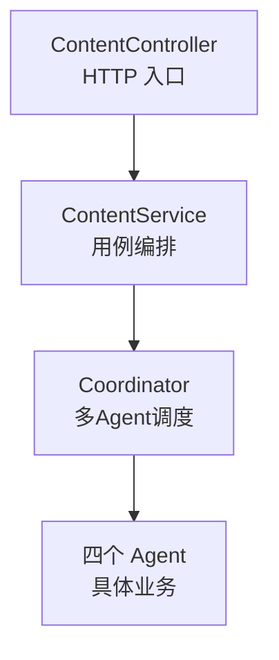

# 第七章 企业最佳实践：从「能跑」到「能上生产」

> 本章目标：把前六章搭起来的 Multi-Agent 框架，用企业级视角"过一遍安检"——异常处理、日志可观测性、分层职责、配置管理、性能与并发、安全边界、测试策略。学完你就能回答那个高频面试题：**"你的 Demo 怎么才能上生产？"**

---

## 7.0 本章导读

前六章我们完成了：Agent 抽象（模板方法）、四个业务 Agent、黑板（SharedMemory）、调度大脑（Coordinator + AgentManager）。**代码能跑通了**。但"能跑"和"能上生产"之间，隔着一整套工程实践。

本章不再写新功能，而是把已有代码放到**生产环境的显微镜**下审视：

- **异常处理**：一个 Agent 崩了，整个系统会怎样？
- **可观测性**：出了问题，你能不能三分钟定位到是哪个 Agent、哪一步？
- **分层职责**：Controller / Service / Coordinator / Agent 各自的边界在哪？
- **配置管理**：Mock 模型怎么优雅切换成真实模型？
- **性能与并发**：多请求同时打进来会串数据吗？瓶颈在哪？
- **安全边界**：用户输入直接喂给 LLM 安全吗？
- **测试策略**：这套东西怎么写单元测试和集成测试？

每一节都对应我们**真实代码里的具体设计**，边讲原则边指出"我们在哪里已经做到了、哪里还能加强"。

---

## 7.1 异常处理：让失败"优雅"而非"灾难"

### 7.1.1 三道防线

我们的框架有三道异常防线，从里到外：

**第一道：模板方法的统一兜底（AbstractAgent）**

在第三、四章我们讲过，`AbstractAgent.execute()` 是 `final` 的，内部用 try-catch 包住了业务方法 `doExecute()`。任何一个 Agent 的业务代码抛异常，都不会让线程崩溃——而是被捕获、记录到日志、转换成"失败的 AgentResult"。

```java
// AbstractAgent 模板方法的异常兜底（回顾第三章）
try {
    doExecute(context);           // 业务子类实现
    // ... 记录成功日志
} catch (Exception e) {
    onError(context, e);          // 钩子：子类可定制
    // ... 记录失败日志，返回失败结果
}
```

**收益**：单个 Agent 的 bug 不会"传染"整个系统。这是模板方法把"横切的异常处理"统一到基类的价值。

**第二道：Coordinator 的快速失败（Coordinator）**

第六章讲过，Coordinator 遍历流水线时，每一步执行后立即检查 `result.isSuccess()`。一旦失败，**立即终止后续 Agent**，返回带全链路日志的失败响应：

```java
if (!result.isSuccess()) {
    return ContentResponse.fail(role + " 执行失败", context.getLogs());
}
```

**收益**：不做无用功（大纲都没出来就别研究了），并且失败响应里带着 `context.getLogs()`，调用方能看到"卡在哪一步"。

**第三道：Service 的入参校验（ContentService）**

看真实代码 [`ContentService.produce()`](../../service/ContentService.java:39)——它在委托 Coordinator 之前先做"防御式校验"：

```java
if (request == null || request.getTopic() == null || request.getTopic().isBlank()) {
    return ContentResponse.fail("主题(topic)不能为空", null);
}
```

**收益**：脏输入在最外层就被挡住，不会浪费下游资源，返回信息也友好。

### 7.1.2 企业增强建议

V1 已有三道防线，生产环境还可以加强：

| 增强项 | 说明 |
| --- | --- |
| **全局异常处理器** | 用 `@RestControllerAdvice` 统一兜住未预料异常，避免堆栈泄露给前端 |
| **超时控制** | 给 LLM 调用加超时（如 30s），防止某个 Agent 卡死拖垮整条链路 |
| **重试与熔断** | 对可恢复的 LLM 调用失败做有限重试 + 熔断降级 |
| **错误码规范** | 把失败原因结构化成错误码，方便调用方程序化处理 |

> 💡 **原则**：生产系统的异常处理不是"不出错"，而是"出错时能优雅降级、快速定位、不扩散"。

---

## 7.2 可观测性：让系统"可被看见"

### 7.2.1 我们已经做到的：全链路执行日志

企业级 Multi-Agent 最怕"黑盒"——文章生成了，但没人知道中间每个 Agent 干了什么。我们的核心武器是 [`AgentExecutionLog`](../../entity/AgentExecutionLog.java:32)：

它记录了**每个 Agent 一次执行的完整审计信息**：

- `step`：第几步（从 1 开始），便于按顺序展示；
- `role`：哪个 Agent；
- `success`：成功还是失败；
- `inputSummary` / `outputSummary`：输入输出摘要（裁剪后）；
- `costMillis`：耗时毫秒；
- `startTime`：开始时间；
- `message`：附加说明（失败原因）。

**关键设计**：这些日志由 `AbstractAgent` 在模板方法里**自动生成**，业务 Agent 无需关心。这就是模板方法把"横切关注点"统一处理的又一次体现。

### 7.2.2 日志随响应返回：可观测性对外暴露

最妙的是——这些日志不只是打在控制台，还随 [`ContentResponse`](../../dto/ContentResponse.java:34) 一起返回给调用方：

```java
private List<AgentExecutionLog> logs;   // 全链路执行日志
```

即使失败，[`ContentResponse.fail()`](../../dto/ContentResponse.java:82) 也带上已产生的日志：

```java
public static ContentResponse fail(String message, List<AgentExecutionLog> logs) {
    return ContentResponse.builder().success(false).message(message).logs(logs).build();
}
```

**收益**：调用方（甚至前端页面）能直接看到"PlannerAgent 花了 12ms 生成 5 个小节、ReviewerAgent 打了 0.9 分"——这就是把可观测性做成了产品能力，而不只是运维工具。

### 7.2.3 企业增强建议

| 增强项 | 说明 |
| --- | --- |
| **结构化日志** | 用 JSON 格式日志 + traceId 贯穿全链路，接入 ELK/Loki |
| **分布式追踪** | 接入 OpenTelemetry，把每个 Agent 变成一个 Span |
| **指标监控** | 暴露 Micrometer 指标：各 Agent 成功率、P99 耗时、评分分布 |
| **持久化日志** | 把 AgentExecutionLog 落库（当前只在内存/响应里），便于事后审计 |

---

## 7.3 分层职责：薄 Controller、用例 Service、编排 Coordinator

我们的调用链是四层，每层职责严格分离：



### 7.3.1 Controller：薄如纸

看真实代码 [`ContentController`](../../controller/ContentController.java:40)——它**只做三件事**：接收 HTTP、委托 Service、返回结果。零业务逻辑：

```java
@PostMapping("/produce")
public ContentResponse produce(@RequestBody ContentRequest request) {
    log.info("[Controller] POST /produce，主题={}", ...);
    return contentService.produce(request);   // 一行委托，绝不写业务
}
```

它还贴心地提供了两个端点：`POST /produce`（标准 JSON）和 `GET /quick`（浏览器直测）。**薄 Controller 原则**：Controller 只管 HTTP 协议转换，不碰业务。

### 7.3.2 Service：用例编排层

看 [`ContentService.produce()`](../../service/ContentService.java:39)——它做"翻译 + 转交"：

1. 入参校验（脏输入拦截）；
2. DTO → 领域对象：`Task task = Task.of(request.getTopic(), request.getRequirement())`；
3. 委托 Coordinator：`coordinator.coordinate(task)`；
4. 返回结果。

**为什么要这层而不让 Controller 直接调 Coordinator？** 源码注释说得很清楚：隔离 Web 层与领域层，便于将来加事务、缓存、鉴权等横切逻辑而不污染 Controller。

### 7.3.3 Coordinator：领域编排层

Coordinator 才是真正"懂多 Agent 怎么协作"的大脑（第六章详解）。Service 不关心它内部怎么调度，只管"给我一个 Task，还我一个 ContentResponse"。

> 💡 **原则**：每一层只依赖它的下一层的**抽象**，职责单一、边界清晰。这就是为什么加需求时你能精准知道"这段代码该放哪层"。

---

## 7.4 配置管理与可插拔模型：从 Mock 到真实

### 7.4.1 为什么默认用 Mock？

整个项目最贴心的一个设计：**开箱即运行、不依赖任何真实 API Key**。看 [`MockLlmClient`](../../config/MockLlmClient.java:23)——它实现了 `LlmClient` 接口，标注 `@Component` 自动注册为默认大模型。它不真正联网，而是根据 systemPrompt 里的"角色标识"分流返回结构合理的模拟内容：

```java
if (sp.contains("规划")) {
    return mockPlan(userPrompt);       // 返回 ||| 分隔的大纲
} else if (sp.contains("研究") || sp.contains("素材")) {
    return mockResearch(userPrompt);   // 返回素材
} else if (sp.contains("写作") || sp.contains("正文")) {
    return mockWrite(userPrompt);      // 返回 Markdown 草稿
} else if (sp.contains("评审") || sp.contains("审校")) {
    return mockReview(userPrompt);     // 返回 "0.9|评审意见"
}
```

注意 `mockPlan` 返回的正是 `|||` 分隔的小节，`mockReview` 返回的正是 `分数|意见` 格式——**它精准贴合了第四章各 Agent 的解析契约**，所以学生 clone 下来就能跑通完整流水线，看到真实协作过程，而不是卡在"没有 Key"。

### 7.4.2 切换真实模型：一个接口的红利

`MockLlmClient` 的类注释写得很清楚：

> 切换真实模型：只要写一个 OpenAiLlmClient 实现 LlmClient，用 `@Primary` 或配置开关替换本 Bean 即可，Agent 代码一行都不用改。

这就是第三章讲的**依赖倒置原则（DIP）**的红利兑现。四个 Agent 依赖的是 `LlmClient` 抽象，不认识 Mock 还是真实：

```java
@Component
@Primary   // 生产环境用这个真实实现覆盖 Mock
public class OpenAiLlmClient implements LlmClient {
    @Override
    public String chat(String systemPrompt, String userPrompt) {
        // 真正调用 OpenAI / Spring AI ChatClient
    }
}
```

### 7.4.3 企业配置管理建议

| 增强项 | 说明 |
| --- | --- |
| **配置外置** | API Key、模型名、温度等放 `application.yml` / 环境变量，绝不硬编码 |
| **多 Profile** | `dev` 用 Mock、`prod` 用真实模型，`@Profile` 切换 |
| **配置开关** | 用 `@ConditionalOnProperty` 让"是否启用真实模型"可配置 |
| **密钥安全** | API Key 走密钥管理（KMS/Vault/环境变量），绝不进代码仓库 |

> 💡 **原则**：可插拔的接口 + 外置配置 = 环境切换零改代码。这是"面向接口编程"最实在的收益。

---

## 7.5 性能与并发：无状态、线程安全、并行化

### 7.5.1 我们已做到的：无状态服务天然线程安全

Coordinator、Service、Controller、四个 Agent 全部是 Spring **单例**。多请求并发会串数据吗？**不会**——因为它们都是"无状态"的：

- Coordinator 的 `coordinate()` 里，`memory`、`context` 都是**方法局部变量**，每次调用独立创建；
- 四个 Agent 没有可变实例字段，只依赖注入的 `LlmClient`（也无状态）；
- 每个请求的黑板 `SharedMemory` 是独立实例，互不干扰。

**这是"无状态服务"的经典设计**：状态随请求走（在方法栈上），Bean 本身不持有请求态数据，所以单例可安全并发。

### 7.5.2 黑板的并发伏笔：ConcurrentHashMap

第五章讲过，`SharedMemory` 内部用的是 `ConcurrentHashMap` 而非普通 `HashMap`。当前 V1 是顺序流水线，其实用不到并发容器——但这是**为未来并行聚合预留的伏笔**。当某天要"多个 ResearchAgent 并发写素材"时，黑板不用改一行就能安全并发写入。

### 7.5.3 性能瓶颈在哪？

对 Multi-Agent 系统，**性能瓶颈几乎永远是 LLM 调用**（网络 IO + 模型推理），而不是我们的 Java 编排代码。所以优化方向是：

| 优化方向 | 说明 |
| --- | --- |
| **并行化独立步骤** | 无依赖的 Agent 可并发（如多路检索），用线程池 + CompletableFuture |
| **流式输出** | WriterAgent 可流式返回，改善用户感知延迟 |
| **缓存** | 相同主题的规划/素材可缓存，避免重复调 LLM |
| **超时兜底** | 单个 LLM 调用超时立即降级，不拖垮整链路 |

> ⚠️ **注意**：并行化的调度逻辑属于 **Coordinator**（第六章 6.4），不该塞进 Agent。Agent 只管"做好自己那一棒"。

---

## 7.6 安全边界：用户输入不可信

Multi-Agent 系统的输入最终会喂给 LLM，安全不容忽视：

### 7.6.1 我们已做到的：入参校验

[`ContentService`](../../service/ContentService.java:39) 在最外层做了空值/空白校验，脏输入直接被拒。这是"输入校验"的第一步。

### 7.6.2 企业安全增强

| 风险 | 防护措施 |
| --- | --- |
| **提示词注入（Prompt Injection）** | 用户输入可能包含"忽略以上指令"等攻击文本；应对用户输入做转义/隔离，systemPrompt 与 userPrompt 分离（我们的 `chat(systemPrompt, userPrompt)` 已做物理分离，是好基础） |
| **输出内容安全** | LLM 输出可能含违规内容；发布前应过内容审核 |
| **越权/滥用** | 加鉴权、限流（每用户 QPS），防止接口被刷 |
| **敏感信息泄露** | 日志摘要要脱敏（我们的 inputSummary/outputSummary 已做裁剪，但生产还需脱敏） |
| **成本失控** | LLM 调用要花钱；加配额、超长输入截断、异常熔断 |

> 💡 **观察**：我们的 `LlmClient.chat(systemPrompt, userPrompt)` 把系统指令和用户输入分成两个参数，这本身就是抵御提示词注入的良好起点——系统指令不会被用户输入"污染"。

---

## 7.7 测试策略：单元 + 集成，Mock 是天赐良机

### 7.7.1 单元测试：每个 Agent 独立可测

因为四个 Agent 都依赖抽象的 `LlmClient`，单测时可以注入一个"测试桩"来精确控制返回值：

```java
@Test
void plannerAgent_shouldParseOutlineBySeparator() {
    LlmClient stub = (sp, up) -> "小节A|||小节B|||小节C";   // 桩：可控返回
    PlannerAgent agent = new PlannerAgent(stub);
    AgentContext ctx = new AgentContext(Task.of("测试主题", null), new SharedMemory());

    agent.execute(ctx);

    List<String> outline = ctx.getMemory().get(SharedMemory.Keys.OUTLINE, List.class);
    assertThat(outline).containsExactly("小节A", "小节B", "小节C");
}
```

**这就是依赖倒置对可测试性的红利**：不用真实模型，就能验证"解析逻辑正确"。

### 7.7.2 集成测试：整条流水线端到端

因为默认的 `MockLlmClient` 就能跑通全流程，集成测试非常简单：

```java
@SpringBootTest
class ContentPipelineIT {
    @Autowired ContentService contentService;

    @Test
    void produce_shouldReturnArticleAndLogs() {
        ContentResponse resp = contentService.produce(
                ContentRequest.builder().topic("AI 编程工具推荐").requirement("面向初学者").build());

        assertThat(resp.isSuccess()).isTrue();
        assertThat(resp.getArticle()).contains("#");        // 有 Markdown 标题
        assertThat(resp.getLogs()).hasSize(4);              // 四个 Agent 都执行了
        assertThat(resp.getScore()).isGreaterThan(0.0);
    }
}
```

**Mock 模型让集成测试不依赖外网、不花钱、结果确定**——这是可插拔设计送给测试的大礼。

### 7.7.3 测试金字塔建议

| 层级 | 测什么 | 数量 |
| --- | --- | --- |
| **单元测试** | 各 Agent 解析逻辑、SharedMemory 读写、评分钳制 | 最多 |
| **集成测试** | Coordinator 全流水线、失败快速终止、日志完整性 | 适中 |
| **端到端** | Controller HTTP 端点（MockMvc） | 最少 |

---

## 7.8 生产上线检查清单（Checklist）

把这套框架推上生产前，逐项对照：

- [ ] **异常**：加了全局异常处理器、LLM 调用超时、失败重试/熔断；
- [ ] **可观测**：结构化日志 + traceId、指标监控、AgentExecutionLog 落库；
- [ ] **配置**：API Key 外置到环境变量/密钥管理，多 Profile 区分环境；
- [ ] **模型**：写了真实 `LlmClient` 实现，`@Primary` 覆盖 Mock，配置开关可回退；
- [ ] **并发**：确认所有 Bean 无状态，独立步骤评估并行化；
- [ ] **安全**：输入校验 + 提示词注入防护 + 内容审核 + 鉴权限流；
- [ ] **成本**：LLM 调用配额、超长输入截断、成本监控；
- [ ] **测试**：单测覆盖各 Agent、集成测试覆盖流水线、CI 自动跑；
- [ ] **降级**：真实模型不可用时能回退 Mock 或友好提示。

---

## 7.9 常见问题 FAQ

**Q1：为什么默认用 Mock 而不直接接真实模型？**
A：为了"开箱即运行、零门槛"。学生 clone 就能跑通完整四棒流水线，不被 API Key 卡住。接真实模型只需新增一个 `LlmClient` 实现（DIP 红利）。

**Q2：Coordinator/Agent 是单例，并发安全吗？**
A：安全。它们无状态——请求态数据（memory/context）都是方法局部变量，每次调用独立创建，Bean 本身不持有可变请求数据。

**Q3：AgentExecutionLog 是谁生成的？业务 Agent 要手动记吗？**
A：由 `AbstractAgent` 模板方法在 after/onError 阶段**自动生成**，业务 Agent 无需关心。这是模板方法统一横切关注点的体现。

**Q4：失败时为什么还要返回日志？**
A：可观测性。`ContentResponse.fail(message, logs)` 带上已产生的日志，调用方能立刻看到"卡在哪一步、之前几步产出了什么"，便于排查。

---

## 7.10 面试高频题

1. **你的多 Agent 系统怎么保证单个 Agent 崩溃不影响整体？**
   （参考答案：三道防线——模板方法 try-catch 兜底转失败结果、Coordinator 快速失败终止、Service 入参校验。异常不扩散、优雅降级。）

2. **你怎么实现全链路可观测性？**
   （参考答案：AgentExecutionLog 记录每步 role/耗时/成败/输入输出摘要，由模板方法自动生成，随 ContentResponse 返回；生产再加 traceId、指标、落库。）

3. **单例 Bean 如何保证并发安全？你的系统哪里体现了？**
   （参考答案：无状态设计，请求态放方法局部变量。Coordinator.coordinate 的 memory/context 每次独立创建，Agent 无可变字段。）

4. **从 Mock 切到真实模型要改多少代码？为什么？**
   （参考答案：只需新增一个 LlmClient 实现并 @Primary 覆盖，Agent 一行不改。因为依赖倒置——Agent 依赖抽象接口。）

5. **Multi-Agent 系统的性能瓶颈通常在哪？怎么优化？**
   （参考答案：瓶颈是 LLM 调用。优化：独立步骤并行化、流式输出、缓存、超时兜底。并行调度逻辑放 Coordinator。）

6. **怎么防提示词注入？**
   （参考答案：systemPrompt 与 userPrompt 物理分离、对用户输入转义隔离、输出内容审核、鉴权限流。我们的 chat(systemPrompt,userPrompt) 双参已做分离。）

---

## 7.11 本章练习（含参考答案）

**练习 1**：写一个 `OpenAiLlmClient implements LlmClient`（可用伪代码），说明如何让它在 `prod` 环境生效、`dev` 仍用 Mock。

<details><summary>参考答案</summary>

```java
@Component
@Profile("prod")
@Primary
public class OpenAiLlmClient implements LlmClient {
    private final ChatClient chatClient;   // Spring AI
    @Override public String chat(String sp, String up) {
        return chatClient.prompt().system(sp).user(up).call().content();
    }
    @Override public String name() { return "OpenAiLlmClient"; }
}
```
`@Profile("prod")` 让它只在生产激活；`@Primary` 覆盖 Mock。dev 环境不加载它，仍用默认 MockLlmClient。四个 Agent 一行不改。
</details>

**练习 2**：为 PlannerAgent 写一个单元测试，验证它能按 `|||` 正确解析大纲。说明为什么不需要真实模型。

<details><summary>参考答案</summary>

见 7.7.1 示例。不需要真实模型，因为 PlannerAgent 依赖抽象 `LlmClient`，测试时注入一个返回固定字符串的 Lambda 桩即可精确控制输入，专注验证解析逻辑——这是依赖倒置对可测试性的红利。
</details>

**练习 3**：列出你认为这套框架上生产前**最关键的 3 项**改造，并说明理由。

<details><summary>参考答案</summary>

言之成理即可，推荐：① 接真实模型 + API Key 外置（否则只是玩具）；② LLM 调用超时 + 熔断降级（否则单点卡死拖垮全链路）；③ 鉴权限流 + 成本配额（否则接口被刷、成本失控）。这三项直接关系到"能不能安全、稳定、可控地对外服务"。
</details>

---

## 7.12 本章任务

> ✅ **动手清单**（对应代码：`config/MockLlmClient.java`、`service/ContentService.java`、`controller/ContentController.java`、`entity/AgentExecutionLog.java`、`dto/ContentResponse.java`）

1. 阅读 `MockLlmClient`，找出它如何按角色标识分流，并对照第四章各 Agent 的解析契约。
2. 阅读 `ContentService` 与 `ContentController`，画出四层调用链并标注每层职责。
3. 找出"全链路日志随响应返回"的代码路径（AbstractAgent → context → ContentResponse.logs）。
4. 完成练习 2：为 PlannerAgent 写一个不依赖真实模型的单元测试并跑通。
5. **挑战题**：完成练习 1，写一个 `@Profile("prod")` 的真实 LlmClient 骨架，验证 dev 下仍用 Mock、prod 下用真实实现。
6. 对照 7.8 上线检查清单，给这套框架做一次"生产就绪度自评"。

**下一章预告**：第八章我们做**最终项目落地**——把所有部件串起来，启动应用、调用接口、看四棒接力产出真实文章与全链路日志，完成从零到一的完整闭环，并给出后续演进路线图。