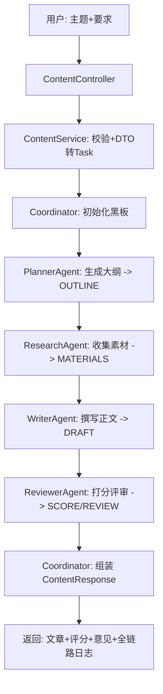
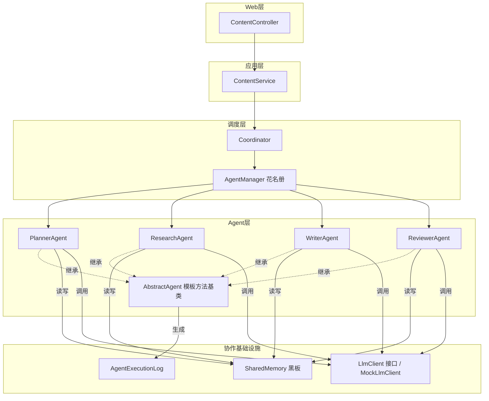

# 第八章 最终项目落地：从零到一跑通完整闭环

> 本章目标：把前七章的所有部件串起来，**真正启动应用、调用接口、看四棒接力产出一篇文章和全链路日志**，完成从零到一的完整闭环。最后给出后续演进路线图，让你知道"下一步往哪走"。

---

## 8.0 本章导读

到这里，我们已经拥有：

- **抽象层**：`Agent` 接口 + `AbstractAgent` 模板方法基类（第三章）；
- **四个业务 Agent**：Planner / Research / Writer / Reviewer（第四章）；
- **黑板**：`SharedMemory`（第五章）；
- **调度大脑**：`Coordinator` + `AgentManager`（第六章）；
- **应用层**：`ContentService`、`ContentController`、DTO、Mock 模型（第七章讲了工程实践）。

本章不再写新架构，而是**把它们真正跑起来**——启动、调用、验证、观察，然后规划未来。这是最有成就感的一章：你会亲眼看到"输入一个主题，四个 Agent 接力产出一篇完整文章"。

---

## 8.1 完整数据流回顾：一次请求的一生

在动手前，先在脑海里过一遍"一次请求的完整旅程"：



**每一步的产物都写进黑板，下一步从黑板读**（第五章）。每个 Agent 执行都被记进 `AgentExecutionLog`（第七章）。任一步失败，Coordinator 立即快速失败并带回日志（第六章）。这就是我们七章搭起来的完整机制。

---

## 8.2 第一步：用 JDK 21 编译项目

> ⚠️ **重要前提**：本项目**必须用 JDK 21 编译运行**。若用低版本 JDK，Lombok 注解处理会全局失效，导致大量“找不到 getter/builder”的编译错误。

在项目根目录 `agnetstudy-main` 下执行：

```bash
# 指定 JDK 21（macOS 示例路径，按你的实际安装调整）
export JAVA_HOME=/Users/你的用户名/Library/Java/JavaVirtualMachines/ms-21.0.6/Contents/Home

# 编译
mvn clean compile
```

看到 `BUILD SUCCESS` 且生成了 day08multiagent 下所有 class，说明编译通过。我们的 14 个 Java 文件应全部编译成功。

---

## 8.3 第二步：启动 Spring Boot 应用

```bash
mvn spring-boot:run
```

启动日志里你会看到：

- Spring 扫描并注册了四个 Agent Bean（PlannerAgent/ResearchAgent/WriterAgent/ReviewerAgent）；
- `AgentManager` 通过 `List<Agent>` 自动装配收集它们，建好 EnumMap 花名册（第六章）；
- `MockLlmClient` 注册为默认 `LlmClient`（第七章）；
- 内嵌 Tomcat 在 `8080` 端口就绪。

看到 `Started ...Application in X seconds` 即启动成功。

---

## 8.4 第三步：调用接口，见证四棒接力

我们在 [`ContentController`](../../controller/ContentController.java:40) 提供了两个端点，任选其一。

### 8.4.1 方式一：GET 快捷端点（浏览器可直接测）

直接在浏览器打开或用 curl：

```bash
curl "http://localhost:8080/day08/content/quick?topic=2024年最值得推荐的AI编程工具&requirement=面向Java初学者，800字"
```

### 8.4.2 方式二：POST 标准端点（推荐，JSON 入参）

```bash
curl -X POST http://localhost:8080/day08/content/produce \
     -H "Content-Type: application/json" \
     -d '{"topic":"2024年最值得推荐的AI编程工具","requirement":"面向Java初学者，800字"}'
```

入参对应 [`ContentRequest`](../../dto/ContentRequest.java:20)：`topic`（必填）+ `requirement`（可选）。

---

## 8.5 第四步：读懂返回结果

响应是一个 [`ContentResponse`](../../dto/ContentResponse.java:34) JSON，结构如下（示意）：

```json
{
  "success": true,
  "article": "# 2024年最值得推荐的AI编程工具\n\n## 开篇\n...\n## 结语\n...",
  "score": 0.9,
  "review": "结构完整、逻辑清晰...建议在「核心要点」补充具体工具名与数据...",
  "logs": [
    { "step": 1, "role": "PLANNER",    "success": true, "costMillis": 12, "outputSummary": "生成5个小节..." },
    { "step": 2, "role": "RESEARCHER", "success": true, "costMillis": 8,  "outputSummary": "素材..." },
    { "step": 3, "role": "WRITER",     "success": true, "costMillis": 15, "outputSummary": "# 2024年..." },
    { "step": 4, "role": "REVIEWER",   "success": true, "costMillis": 5,  "outputSummary": "0.9|..." }
  ],
  "message": "ok"
}
```

**逐字段读懂它，就读懂了整个系统**：

- `article`：WriterAgent 产出的最终 Markdown 文章；
- `score` / `review`：ReviewerAgent 的打分和意见（Mock 返回 0.9）；
- `logs`：**全链路执行日志**——四步都成功，每步花了几毫秒、产出摘要是什么，一目了然。这就是第七章讲的可观测性对外交付；
- `success` / `message`：整体成败与说明。

> 💡 **高光时刻**：`logs` 数组有 4 条、按 step 1→4 排列，正好对应 PLANNER→RESEARCHER→WRITER→REVIEWER 的四棒接力。你输入一个主题，系统就自动完成了"规划→研究→写作→评审"的完整创作流程——这就是 Multi-Agent 协作的魅力。

---

## 8.6 失败场景演示：快速失败与友好降级

系统不仅要能跑通"快乐路径"，也要优雅处理失败。试试传空主题：

```bash
curl -X POST http://localhost:8080/day08/content/produce \
     -H "Content-Type: application/json" \
     -d '{"topic":"","requirement":"随便"}'
```

返回：

```json
{ "success": false, "message": "主题(topic)不能为空", "logs": null }
```

这正是 [`ContentService`](../../service/ContentService.java:39) 最外层的入参校验挡下的（第七章 7.1.1 第三道防线）——脏输入没浪费任何下游资源。

**再想象一个中途失败场景**：假如 WriterAgent 因某种原因执行失败，Coordinator 会立即快速失败，返回：

```json
{ "success": false, "message": "WRITER 执行失败", "logs": [ {step:1 PLANNER 成功}, {step:2 RESEARCHER 成功}, {step:3 WRITER 失败} ] }
```

**注意 logs 里带着前两步的成功记录和第三步的失败记录**——你一眼就能定位"卡在 WRITER"，且知道前面已产出了什么。这就是第六章快速失败携带 `context.getLogs()` 的价值。

---

## 8.7 全书架构总览：一张图看懂所有部件



**每一个方框都在前面章节详细讲过**。这张图就是你这 8 天学习的成果地图——一个遵循 SOLID、可观测、可插拔、可扩展的企业级 Multi-Agent 框架。

---

## 8.8 SOLID 落地清单回顾

回头看，我们把 SOLID 五原则真正落到了代码里：

| 原则 | 在本项目的体现 |
| --- | --- |
| **S 单一职责** | 每个 Agent 只干一件事；Coordinator 只调度；Service 只编排；Controller 只管 HTTP |
| **O 开闭原则** | 新增 Agent 只加类 + PIPELINE 加一行，AgentManager 自动装配收集，调度代码零改动 |
| **L 里氏替换** | 任何 Agent 子类都能被当作 `Agent` 使用；任何 `LlmClient` 实现可互换 |
| **I 接口隔离** | `Agent`、`LlmClient` 接口都小而专，不强迫实现无关方法 |
| **D 依赖倒置** | Agent 依赖 `LlmClient` 抽象而非具体模型；上层依赖下层抽象 |

**这就是"商业级"和"玩具级"的分水岭**：不是功能多，而是结构能扛住变化。

---

## 8.9 演进路线图：V1 之后往哪走

V1 是"能跑通的最小闭环"。接下来的演进方向（对应前几章埋的伏笔）：

| 版本 | 演进方向 | 对应基础 |
| --- | --- | --- |
| **V2 真实模型** | 接入真实 LLM（OpenAI/Spring AI），Mock 退居 dev/测试 | LlmClient 接口（第七章） |
| **V2 反馈循环** | 评审不通过退回重写，构成闭环状态机 | Coordinator 可扩展（第六章 6.4） |
| **V3 并行化** | 多路研究并发、结果聚合 | SharedMemory 用 ConcurrentHashMap（第五章伏笔） |
| **V3 动态编排** | LLM 自主决定下一步调哪个 Agent（路由决策） | Coordinator 调度大脑 |
| **V4 工具能力** | 接入 MCP，ResearchAgent 真正联网检索/查库 | LlmClient 抽象（第六章 6.5） |
| **V4 流程引擎** | 整合 Workflow 引擎，支持可视化编排/人工审批 | Agent 封装为节点（第六章 6.5） |
| **V4 生产化** | 全局异常、追踪、指标、鉴权限流、成本控制 | 第七章上线清单 |

**关键洞察**：每一次演进几乎都是"加法"（新增类/新增实现），而非"改造"（大改已有代码）。这正是良好架构预留扩展点的红利——V1 打的地基，支撑得起后面所有的楼层。

---

## 8.10 企业案例：为什么"跑通闭环"比"堆功能"更重要

某创业团队做 AI 写作平台，一上来就想做"支持 20 种文体、10 个 Agent、可视化编排"，结果三个月没上线一个能用的版本——因为部件之间集成不起来，处处是坑。

另一个团队先做"最小四棒闭环"（正是我们 V1 的思路），两周上线可用版本，之后按需逐个加 Agent、加能力。半年后功能反而更全、更稳。

**教训**：先跑通端到端闭环（哪怕用 Mock），再迭代增强。**一个能跑的简单系统，胜过一个跑不起来的复杂系统**。这也是本训练营从 V1 最小闭环讲起的原因。

---

## 8.11 常见问题 FAQ

**Q1：为什么第一次跑一定要用 JDK 21？**
A：项目依赖 Lombok 生成 getter/builder，低版本 JDK 下 Lombok 注解处理会全局失效，导致满屏“找不到方法”的编译错误。务必先 `export JAVA_HOME` 指向 JDK 21。

**Q2：没有 API Key 能跑吗？**
A：能！默认 `MockLlmClient` 按角色返回结构化模拟内容，全流程开箱即跑。接真实模型只需新增一个 `LlmClient` 实现（第七章）。

**Q3：返回的 logs 有几条？分别是什么？**
A：成功时 4 条，按 step 1→4 对应 PLANNER→RESEARCHER→WRITER→REVIEWER。失败时带上已执行步骤的记录，便于定位。

**Q4：GET 和 POST 两个端点有什么区别？**
A：功能相同。GET `/quick` 用 URL 参数、浏览器可直测；POST `/produce` 用 JSON body、更规范、推荐生产使用。二者最终都走 `ContentService.produce`。

---

## 8.12 面试高频题

1. **完整描述一次内容生产请求从进入到返回的全过程。**
   （参考答案：Controller 收 HTTP → Service 校验并 DTO 转 Task→ Coordinator 初始化黑板 → 四个 Agent 依次读写黑板接力 → 每步记 AgentExecutionLog → Coordinator 组装 ContentResponse 返回，含文章/评分/意见/全链路日志。）

2. **你的系统如何做到"新增文体只加类不改核心"？**
   （参考答案：Agent 抽象 + AgentManager 自动装配 + PIPELINE 数据化声明，OCP 落地。）

3. **失败时你怎么保证可排查？**
   （参考答案：快速失败 + 返回携带 context.getLogs()，能定位卡在哪一步、之前产出什么。）

4. **这套框架下一步怎么演进到真实生产？**
   （参考答案：接真实模型、加反馈循环、并行化、MCP 工具能力、Workflow 编排、可观测/安全/成本治理，均为加法式扩展。）

5. **你觉得这个项目最能体现工程能力的是哪一点？**
   （参考答案：不是功能多，而是结构——SOLID 落地让系统能扛变化；先跑通最小闭环再迭代的务实路线。）

---

## 8.13 结业练习（含参考答案）

**练习 1**：完整跑通一次流程：编译 → 启动 → POST 调用 → 截图/记录返回的 logs 四条记录。

<details><summary>参考答案</summary>

按 8.2→8.3→8.4.2 执行。成功标志：返回 `success:true`、`article` 含 Markdown 标题、`logs` 有 4 条按 step 1-4 排列、`score` 约 0.9。若失败先检查 JAVA_HOME 是否指向 JDK 21。
</details>

**练习 2**：故意传空 topic，观察失败响应，说明是哪道防线拦下的。

<details><summary>参考答案</summary>

返回 `success:false, message:"主题(topic)不能为空"`。是 ContentService.produce 最外层的入参校验拦下的（第七章 7.1.1 第三道防线），脏输入未消耗下游资源。
</details>

**练习 3（综合挑战）**：为系统新增第五个 Agent —— `TranslatorAgent`（把文章翻译成英文），插到 WRITER 之后、REVIEWER 之前，完整跑通。列出你改动的所有文件。

<details><summary>参考答案</summary>

改动：① `AgentRole` 枚举加 `TRANSLATOR`；② 新建 `TranslatorAgent extends AbstractAgent`（读 DRAFT，调 LLM 翻译，写回 DRAFT 或新 Key）；③ `Coordinator.PIPELINE` 在 WRITER 后加 `AgentRole.TRANSLATOR`；④（若 Mock 需支持）给 MockLlmClient 加"翻译"分支。AgentManager、其他 Agent、SharedMemory 均零改动——这是 OCP + 自动装配的红利。用 `mvn compile` 验证编译通过、重启调用观察 logs 变成 5 条。
</details>

---

## 8.14 结业寄语

恭喜你走到这里！回顾这 8 天，你从"一个 Agent 是什么"出发，亲手搭起了一个遵循 SOLID、可观测、可插拔、可扩展的**企业级 Multi-Agent 框架**，并跑通了"规划→研究→写作→评审"的完整创作闭环。

你收获的不只是代码，更是三种能力：

1. **架构思维**：用抽象、模式、原则去驾驭复杂度，让系统能扛住变化；
2. **协同设计**：理解多个 Agent 如何通过黑板与调度大脑协作，这是 AI 应用的核心范式；
3. **工程素养**：异常、可观测、配置、并发、安全、测试——从"能跑"到"能上生产"的全套实践。

Multi-Agent 是 AI 应用的未来主战场之一。你现在手里的这套框架，就是通往 V2、V3、V4 的地基。**接下来，去接真实模型、去加反馈循环、去接 MCP 工具能力**——按 8.9 的路线图，一层一层把楼盖起来。

> 🎓 **训练营终点，也是你 AI Agent 工程之路的起点。动手，迭代，然后创造属于你自己的智能体系统。**